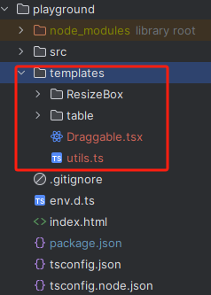

## 前端快速生成代码片段

### usage
#### 安装
```text
npm add @snipaste-cli/core -D
```

#### 下载代码块
```text
// 默认在~/templates/antdPro下生成antd代码片段
npx sc antdPro

// 指定生成路径,eg: 在 ~/a/v/d下生成
npx sc antdPro -des a/v/d
```



#### 安装依赖
> 如果要运行代码块，需要安装以下依赖
```text
// 根据项目选择安装
npm add @dnd-kit/core @dnd-kit/modifiers @dnd-kit/sortable @dnd-kit/utilities ahooks lodash-es'

// 也可以下载时指定 "--install" 参数自动下载，支持 npm | yarn | pnpm
npx sc antdPro -i // 待测试
```

#### 预览代码块
将下载到模板复制到src里到任意目录，引用其中到组件就能看到效果
```tsx
import React from 'react';
import ConfigurableTable from './components/table/ConfigurableTable';

function App() {
  return <div className="app">
    <ConfigurableTable />
  </div>
}

export default App;
```

### 命令参数
#### sc
```text
// 下载模板
npx sc antdPro

// 指定存放路径, 默认 templates
-des, --destination [path]

// 是否自动安装依赖，默认 false
-i, --install

// 如果自动安装依赖，选择包管理工具，npm、yarn(未测试)或pnpm
-pt, --pkg-tool [npm|yarn|pnpm]
```

#### add

##### add c
新增一个组件
```text
// 基本用法
npx sc add c CompA --frame react
将生成:
 src/components/CompA/index.tsx
 src/components/CompA/style.css

// 指定框架，目前只有vue3和react
--frame [react|vue3]

// 指定目录
npx sc add c a/b/cCompA // 将在src/a/b/c 下生成
```


##### add d
新增一个指令(vue3 only)
```text
// 基本用法
npx sc add d DireA // 将生成:  src/directive/DireA.js

// 指定目录
npx sc add d a/b/DireA // 将在src/a/b 下生成
```

##### 其它命令
```text
// 查看版本
vmc -V

// 查看帮助信息
vmc -h

vmc add -h

vmc add c -h
...

```
